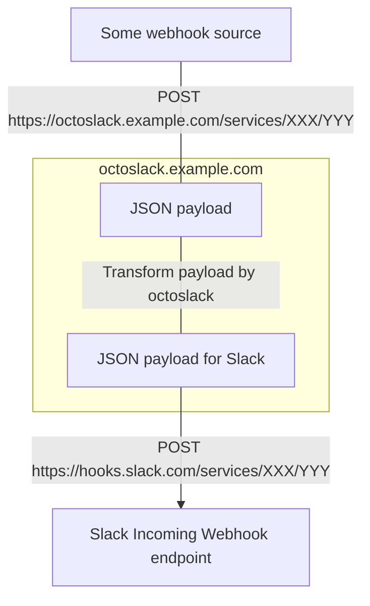
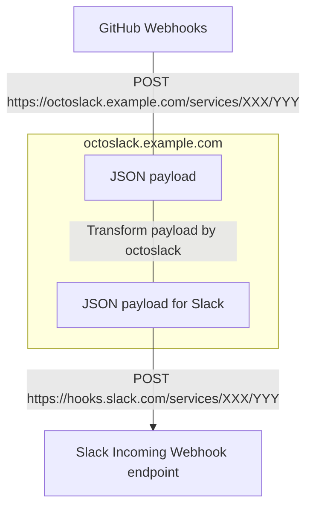

# octoslack

[](https://github.com/k1LoW/octoslack/actions/workflows/ci.yml)  

`octoslack` is a tool for transforming HTTP requests from any webhook into Slack messages.

## Usage



### 0. Requirements

- Slack Incoming Webhook URL ( `https://hooks.slack..com/services/XXX/YYY` )

### 1. Setup config.yml

Describe the settings for transforming/forwarding/dropping HTTP requests from the target webhook.

In particular, octoslack targets [GitHub repository webhooks](https://docs.github.com/en/rest/webhooks?apiVersion=2022-11-28), so it parses the `X-GitHub-Event` header ( to `github_event` ).

``` yaml
# config.yml
requests:
  -
    condition: github_event == 'discussion' && payload.action == 'created'
    action: transform
    transform:
      blocks:
        - type: section
          text:
            type: mrkdwn
            text: 'Discussion created by {{ payload.user.login }}'
        - type: section
          text:
            type: mrkdwn
            text: '{{ quote(payload.discussion.body) }}'
  -
    condition: github_event == 'ping'
    action: forward
```

### 2. Start octoslack server

Start the octoslack server and make the server accessible from the Internet.

``` console
$ octoslack server -c config.yml -p 8080
```

If you want to use a Docker image and start the server using the config file in the GitHub repository, you can run the following.

``` sh
$ docker container run -it --rm --name octoslack-server \
  -e OCTOSLACK_CONFIG=github://k1LoW/octoslack/testdata/config.yml \
  -e OCTOSLACK_PORT=8080 \
  -e GITHUB_TOKEN \ # use GITHUB_TOKEN for getting config.yml from GitHub repository
  -p 8080:8080 \
  ghcr.io/k1low/octoslack:latest
```

Here, assume it is published as `https://octoslack.example.com`.

### 3. Set Slack Incoming webhook URL by changing the host to `octoslack.example.com`

Change the host of the Slack Incoming webhook URL to `octoslack.example.com`.

`https://hooks.slack..com/services/XXX/YYY` -> `https://octoslack.example.com/services/XXX/YYY`

And set it as the destination URL.

### 4. Webhook event fired

HTTP requests are

- transformed into requests that Slack can read through octoslack.
- forwarded directly to Slack.
- dropped.



Drop all requests that do not match the conditions.

## Actions selectable for the request ( `action:` )

### `transform`

Transform into requests that Slack can read through octoslack.

### `forward`

Forward request directly to Slack.

### `drop`

Drop request.

## Expression evaluation engine

octoslack has embedded [expr-lang/expr](https://github.com/expr-lang/expr) as the evaluation engine for the expression.

It can be used in `requests.[*].condition:` and `requests.[*].transform:`.

See [Language Definition](https://expr.medv.io/docs/Language-Definition).

### Built-in functions

- `quote` ... Quote all lines.
- `shorten_lines` ... Shorten the number of lines.
- `shorten_lines_md` ... Shorten the number of lines considering Slack markdown syntax.
- `string` ... [cast.ToString](https://pkg.go.dev/github.com/spf13/cast#ToString)

## Available variables

| Variable name | Type | Description |
| --- | --- | --- |
| `method` | `string` | Method of HTTP request |
| `headers` | `object` | Headers of HTTP request |
| `path` | `string` | Path of HTTP request |
| `payload` | `object` | Payload of HTTP request |
| `github_event` | `string` | Value of `X-GitHub-Event` header |

## Option

``` console
$ octoslack server -h
start server.

Usage:
  octoslack server [flags]

Flags:
  -c, --config string   config path (default "octoslack.yml")     # env: OCTOSLACK_CONFIG
  -h, --help            help for server
  -p, --port uint       listen port (default 8080)                # env: OCTOSLACK_PORT
  -d, --update-config-interval string   interval to update config # env: OCTOSLACK_UPDATE_CONFIG_INTERVAL
      --verbose         show verbose log                          # env: OCTOSLACK_VERBOSE
$
```
